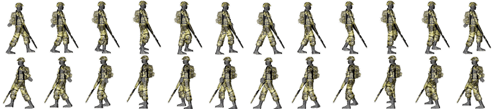

Game Config
=======

SunriseJS is usualy working with as much JSON code as possible to reduce the programming work for all the game producers out there.
If your game has a good config, you will have less programming work!

## Basics

The first thing that have to be defined is the canvas with and high. This is basicly done by setting two variables.

```
config: {
	//Width and height of canvas
	screenWidth: 640,
	screenHeight: 360
}```


*****

## Plugins
If you want to use existing own plugins or components that are not includet. You have to put them here.

```
config: {
	//Canvas With and High

	//example plugins
	plugins: [
		'JumpNRunController',
		'CollisionBody',
		'Physics',
		'SimpleInventory',
		'SimpleItem'
	]


}```

*****

## Images
Usualy every game is at least working with images. All images, also sprites graphics, are defined in the config

```
config: {

	//Canvas With and High
		....

	//Plugins
		....

	//Images to be loaded. Names must be unique
	images: {
		'player': {
			//Path relative to HTML file
			source: 'assets/graphics/YourPlayerGraphic.png',

			//Other images
		}
	}
}
```

If you want to load sprite graphics you have to define a ```tileWidth``` and a ```tileHeight```.
You are also able to preset animations.

```
config: {

	//Canvas With and High
		....

	//Plugins
		....

	//Images to be loaded. Names must be unique
	images: {
		'player-anim': {
			//Path relative to HTML file
			source: 'assets/graphics/YourPlayerGraphic.png',
			//Width and height of one frame/tile
			tileWidth: 96,
			tileHeight: 128,
			//Indicees for animations. Names must be unique
			animations: {
				'walk_right': [0, 1, 2, 3, 4, 5, 6, 7, 8, 9, 10, 11],
				'walk_left': [12, 13, 14, 15, 16, 17, 18, 19, 20, 21, 22, 23],
			}
		}
	}
}
```

This could be a simple sprite graphic:



*****

## Level
It's possible to define multiple [levels](levelconfig.md). 

```
config: {

	//Canvas With and High
		....

	//Plugins
		....

	//Images
		....

	//Levels to be loaded. Names must me unique. Path relative to HTML file.
	levels: {
		level1: "assets/levels/YourLevel.json"
	}
}
```
*****

## Sounds
If you want to play sounds in your game, you need to define those sounds here. 

```
config: {

	//Canvas With and High
		....

	//Plugins
		....

	//Images
		....

	//Levels
		....

	sounds: {
		steps: {
			//Path relative to HTML file.
			file: "assets/sounds/walking.mp3",
			//Flag whether sound should be looped or only played once
			loop: true
		}
	}
}
```
*****

## Predefined entities 
If you want to define an entity like a bot or some other objects that are nearly the same on every appearence.

```
config: {

	//Canvas With and High
		....

	//Plugins
		....

	//Images
		....

	//Levels
		....

	//Sounds
		....
	//Different Types of Entites which can be generated. Names have to be unique.
	"entityTypes": {
		"player": {
			//Width and height of the entity. If different from size provided as tileWidth/tileHeight
			//in images section, the image is stretched
			 "width": 96,
			 "height": 128,
			 //Anchor point on entity relative to upper left corner. 
			 //If entity is moved, scaled or rotated, 
			 //this point is used instead of upper left corner
	         "anchor":{
	            "x": 48,
	            "y": 64
	        },
	        //Groups, the entity is in. 
	        //Important: to be rendered and to have the tick event emitted, 
	        //the entity has to be in group "toRender"
	        "groups":[
	            "player",
	            "toRender"
	        ],
	        //Components of entity. Names must be names of existing components.
	        "components": {
	        	//Renders entity on screen using provided image and animation.
	            "Renderer": {
	            	//Image from image section (see top of this document)
	                "image": "player-anim",
	                //Animation to be renderen. Can be changed by emitting "changeAnimation"
	                "animation": "stand_right"
	            },
	            //Manages moving (and jumping)
	            "JumpNRunController": {
	            	//Keys to use. Defaults are:
	            	//left: a, left,
	            	//right: d, right,
	            	//jump: w, up, space
	            	//These could be removed since they are the default keys, 
	            	//are here for presentation purposes 
	                "keys": {
	                    "left": ["a", "left"],
	                    "right": ["d", "right"]
	                }
	            },
	            //Gives entity the ability to collide with other entities 
	            //which have also a CollisionBody.
	            //Emits "collision" event to all components
	            "CollisionBody": {
	                "x": 25,
	                "y": 10,
	                "width": 48,
	                "height": 116
	            },
	            //Lets entity pickup items
	            "SimpleInventory": {
	                "inventory": ["test"]
	            },
	            //Gives entity mass, acceleration and speed. 
	            //Reacts to collision with other entites 
	            //which also have a physics component
	            //Forces can be added/set by emitting "setForce".
	            "Physics": {
	                "mass": 8,
	                "forces": {
	                    "gravity": {
	                        "x": 0,
	                        "y": 9.81
	                    }
	                }
	            }
	        }
		}
	}
}
```
